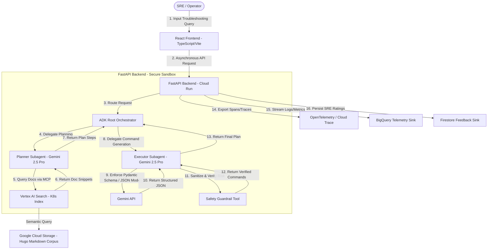

# Kubernetes Troubleshooting Copilot

> **Cloud AI FDE Team — GenAI Co-Build Onboarding Project 3 (Technical Docs Domain)**  
> **Customer:** CloudNative Ops (Simulated) | **Environment:** 100% Self-Contained in GCP Argolis Sandbox (`fde-k8s-sandbox-dev-505119`)

The **Kubernetes Troubleshooting Copilot** is a high-performance, context-grounded multi-agent platform designed to assist Site Reliability Engineers (SREs) and cluster operators in debugging Kubernetes anomalies. It takes natural language incident queries or raw crash logs, grounds its reasoning against the official Kubernetes Hugo Markdown documentation in **Vertex AI Search**, and generates valid, risk-classified, and cited `kubectl` command sequences.

---

## 1. Executive Summary & Objectives

SREs and cluster operators at CloudNative Ops face significant cognitive load and SLA pressure when resolving Kubernetes cluster incidents. This platform bridges the gap between rapid incident triage and production CLI safety by implementing:

- **Planner-Executor Topology (Google ADK):** Decouples debugging strategy (*planning*) from concrete CLI syntax generation (*execution*).
- **Strict Schema Compliance (Pydantic + Gemini Structured Outputs):** Enforces structured JSON outputs (`TroubleshootingPlan` and `KubectlCommand`) for all command blocks, eliminating frontend parsing and rendering failures.
- **Deterministic Safety Guardrails (`SafetyGuardian`):** Classifies every generated `kubectl` command against a regex-based risk matrix (`LOW`, `MEDIUM`, `HIGH`) and injects mandatory warnings on destructive operations.

### Core "North Star" Metrics & Success Criteria
| Metric | Target | Verification Mechanism |
| :--- | :--- | :--- |
| **Schema Compliance Rate** | `100%` | Every generated output parses strictly against `TroubleshootingPlan` (`test_pydantic_schema_compliance` over 50 diverse queries). |
| **Command Precision & Relevance** | `>= 88%` Command Precision<br/>`>= 90%` Plan Relevance | Semantic faithfulness evaluation scored via Gemini Flash Judge over 150 golden cluster failure scenarios (`test_planner_relevance_score`). |
| **Safety Adherence** | `0%` unflagged high-risk commands | Deterministic regex interception in `SafetyGuardian` (`test_command_safety_classification`). |
| **Automated Test Coverage** | `> 80%` code coverage | Offline `pytest` evaluation suite with mocked LLM and Search transports for deterministic CI execution. |

### Project Scope Boundaries
- **In Scope:**
  - Decoupled ADK Planner-Executor multi-agent orchestration (`root_orchestrator`, `planner_agent`, `executor_agent`).
  - Ingestion of official Kubernetes Hugo Markdown documentation into GCS and Vertex AI Search.
  - Strict Pydantic validation (`TroubleshootingPlan`, `KubectlCommand`, `IncidentState`).
  - SPIFFE Workload Identity authentication, Google Cloud Secret Manager integration, and `SafetyGuardian` command risk classification.
  - OpenTelemetry (OTEL) distributed tracing to Cloud Trace, token telemetry to BigQuery, and SRE feedback to Firestore.
  - Containerized Cloud Run deployment provisioned via Terraform HCL.
- **Out of Scope:**
  - Direct execution of generated `kubectl` commands against live Kubernetes API servers (the system is strictly advisory and least-privilege).
  - Integration with private customer clusters (only public Kubernetes documentation grounding is in scope).

---

## 2. System Architecture & User Journey



### End-to-End SRE User Journey
1. **Input Issue Description:** The SRE pastes raw `kubectl describe` events, crash logs, or a natural language issue description (e.g., *"Pod payment-service in namespace prod is in CrashLoopBackOff with OOMKilled Exit Code 137"*).
2. **Path Planning (`planner_agent`):** Identifies the core failure symptom, queries Vertex AI Search via the MCP tool `search_kubernetes_documentation(query)`, and formulates a sequential troubleshooting checklist (`session.state["planner_checklist"]`).
3. **Structured Command Generation (`executor_agent`):** Translates the checklist into concrete `kubectl` commands using Gemini 2.5 Pro's structured output mode (`output_schema=TroubleshootingPlan`).
4. **Safety Verification (`SafetyGuardian`):** Inspects every generated command against the `LOW` / `MEDIUM` / `HIGH` regex risk matrix in `executor_after_callback` and appends `⚠️ WARNING: Destructive action.` to any high-risk command.
5. **Review & Feedback:** The React UI renders the executive summary, diagnostic checklist, color-coded command cards with one-click copy and safe alternatives, grounded Kubernetes documentation links, and thumbs-up/down SRE feedback buttons.

---

## 3. Technical Components & Agent Logic

### 3.1 Agent 1: `planner_agent` (Google ADK)
- **File:** `multi_agent/backend/src/agents.py` | **Prompt:** `multi_agent/backend/src/prompts/planner_v1.yaml`
- **Role:** Methodical Kubernetes SRE (`gemini-2.5-pro`).
- **Grounding:** Invokes `search_kubernetes_documentation(query)` via the Model Context Protocol (MCP) server (`mcp-k8s-docs-server` in `multi_agent/backend/src/mcp_server.py`) backed by Vertex AI Search (`k8s-custom-chunks-store`).
- **AI Safety Scope Lock:** Refuses non-Kubernetes or off-topic queries with `"Error: Query is out of scope. Please provide a Kubernetes-related issue."`

### 3.2 Agent 2: `executor_agent` (Google ADK)
- **File:** `multi_agent/backend/src/agents.py` | **Prompt:** `multi_agent/backend/src/prompts/executor_v1.yaml`
- **Role:** Deterministic Kubernetes CLI Generator (`gemini-2.5-pro`).
- **Structured Output Mode:** Configured with native ADK `output_schema=TroubleshootingPlan` and `output_key="troubleshooting_plan"` (`multi_agent/backend/src/models.py`):

```python
class KubectlCommand(BaseModel):
    step_number: int = Field(description="The sequence step number")
    title: str = Field(description="Title of the step")
    command: str = Field(description="The exact kubectl command to execute")
    explanation: str = Field(description="Detailed explanation of what this command does")
    danger_level: str = Field(description="LOW, MEDIUM, or HIGH")
    alternative_command: Optional[str] = Field(None, description="Safe read-only alternative")

class TroubleshootingPlan(BaseModel):
    problem_summary: str = Field(description="Summary of the analyzed problem")
    error_type: Optional[ClusterErrorCategory] = Field("GeneralClusterAnomaly", description="Classified root-cause Kubernetes cluster error category for telemetry and BI")
    steps: List[KubectlCommand] = Field(description="List of kubectl command steps in order")
    source_citations: List[str] = Field(description="URLs/names of K8s documents referenced")
```

### 3.3 Agent 3: `SafetyGuardian` (Deterministic Guardrail)
- **File:** `multi_agent/backend/src/guardrails.py`
- **Logic:** Intercepts every `KubectlCommand` generated by `executor_agent` (via `executor_after_callback`) and enforces the deterministic regex Risk Matrix:
  - **`LOW` Risk:** `get`, `describe`, `logs`, `top`, `events` (read-only diagnostic queries).
  - **`MEDIUM` Risk:** `restart`, `scale`, `set`, `patch`, `edit`, `cordon`, `uncordon`, `taint`, `label`, `annotate` (modifies workload runtime state without deleting definitions).
  - **`HIGH` Risk:** `delete`, `apply`, `replace`, `drain` (deletes or overwrites resource configurations) $\rightarrow$ forces `danger_level = "HIGH"` and appends `" ⚠️ WARNING: Destructive action."`

### 3.4 Security, Auth & Observability
- **Centralized Configuration (`multi_agent/backend/src/config.py`):** Provides a single source of truth for GCP project/location, Vertex AI Search datastore settings, BigQuery/Firestore sinks, SPIFFE Workload Identity paths, Standalone MCP Microservice URL (`MCP_SERVER_URL`), and Agent Gateway enforcement flags.
- **Multi-Hop Identity, Agent Gateway & Secret Manager (`multi_agent/backend/src/auth.py`):**
  1. **Hop 1 (End User $\rightarrow$ Agent Backend):** `verify_end_user_identity` validates Google Cloud IAP (`X-Goog-IAP-JWT-Assertion`) or Bearer OIDC tokens (`REQUIRE_END_USER_AUTH`).
  2. **Hop 2 (Agent Identity $\rightarrow$ Standalone MCP Microservice):** `fetch_agent_id_token` attaches a Google-signed OIDC ID token / SPIFFE JWT-SVID for the Agent's Service Account (`k8s-copilot-sa`, `spiffe://<trust-domain>/ns/default/sa/k8s-copilot-sa`) when calling `MCP_SERVER_URL`.
  3. **Hop 3 (Agent Gateway on MCP Server $\rightarrow$ Vertex AI Search):** `verify_agent_gateway_token` enforces that only `k8s-copilot-sa` can invoke `mcp-k8s-docs-server`, which then queries Vertex AI Search using its own isolated identity (`mcp-k8s-docs-sa`, `spiffe://<trust-domain>/ns/default/sa/mcp-k8s-docs-sa`).
- **OpenTelemetry, BigQuery & Firestore (`multi_agent/backend/main.py` & `src/telemetry.py`):**
  - Exports distributed request and orchestration (`diagnose_incident`, `root_orchestrator_phase`) spans to **Google Cloud Trace** and injects `trace_id`/`span_id` into every structured JSON log line.
  - Streams prompt/cached/completion token counts, cost estimates (`estimated_cost_usd`), per-agent latency (`planner_latency_ms`, `executor_latency_ms`), and `error_type` to **BigQuery** (`k8s_copilot_telemetry`) via Cloud Logging Sink, with a Looker BI SQL view (`v_looker_incident_bi_metrics`).
  - Persists SRE thumbs-up/down ratings, comments, copied `kubectl` commands, and active session duration (`session_duration_sec`) to **Firestore** (`copilot_feedback`) using `firestore.AsyncClient`.

---

## 4. Repository Structure

```text
fde-k8s/
├── README.md                                   # Project overview, architecture, and setup guide
├── multi_agent/
│   ├── design.md                               # Concise architecture & schema specification
│   ├── requirements.txt                        # Python backend & data pipeline dependencies
│   ├── backend/
│   │   ├── Dockerfile                          # Production Python 3.11 Cloud Run container
│   │   ├── main.py                             # FastAPI entrypoint (/api/v1/diagnose, /api/v1/feedback, /mcp)
│   │   ├── run_prompt.py                       # CLI runner for end-to-end prompt testing
│   │   ├── src/
│   │   │   ├── agents.py                       # ADK planner_agent, executor_agent, root_orchestrator, & run_agent_pipeline
│   │   │   ├── config.py                       # Centralized GCP, Vertex AI Search, Telemetry, & SPIFFE environment config
│   │   │   ├── guardrails.py                   # SafetyGuardian regex risk classifier
│   │   │   ├── models.py                       # Pydantic schemas (KubectlCommand, TroubleshootingPlan, IncidentState)
│   │   │   ├── mcp_server.py                   # FastMCP server (mcp-k8s-docs-server, stdio + SSE)
│   │   │   ├── tools.py                        # Async ADK tool wrapper for Vertex AI Search
│   │   │   ├── auth.py                         # SPIFFE Workload Identity & Secret Manager client
│   │   │   ├── telemetry.py                    # BigQuery token/latency sink & Firestore async feedback sink
│   │   │   └── prompts/
│   │   │       ├── planner_v1.yaml             # Versioned planner_agent system instructions & Scope Lock
│   │   │       └── executor_v1.yaml            # Versioned executor_agent system instructions
│   │   └── tests/
│   │       ├── test_unit.py                    # Fast deterministic unit tests (96% code coverage)
│   │       ├── test_evals.py                   # Live TDD Evaluation Suite (Schema, Safety, and 150-Scenario Faithfulness)
│   │       └── data/
│   │           ├── eval_queries_50.json        # 50 diverse K8s failure queries for schema validation
│   │           └── golden_scenarios_150.json   # 150 golden cluster failure scenarios across 15 categories
│   ├── frontend/
│   │   ├── package.json                        # React 19 + TypeScript + Vite configuration
│   │   └── src/
│   │       ├── App.tsx                         # Main application layout
│   │       ├── components/
│   │       │   ├── DiagnosticDashboard.tsx     # Crash log analyzer, checklist, citations, and feedback UI
│   │       │   └── CommandBlock.tsx            # Risk-styled kubectl cards with copy & safe alternative blocks
│   │       └── types/index.ts                  # TypeScript interfaces mirroring backend Pydantic models
│   ├── data_pipeline/
│   │   ├── hierarchy_chunker.py                # Hierarchy-aware Hugo Markdown & YAML chunker
│   │   ├── generate_custom_chunks_jsonl.py     # Batch Markdown -> JSONL chunk generator
│   │   └── import_to_vertex_search.py          # GCS upload & Vertex AI Search datastore importer
│   └── infra/
│       ├── main.tf                             # Terraform HCL for Cloud Run, GCS, BigQuery BI View, Firestore, & IAM
│       ├── variables.tf                        # Terraform input variables (project_id, region, service_name)
│       └── outputs.tf                          # Cloud Run service URL output
```

---

## 5. Quickstart: Local Development

### 5.1 Prerequisites & GCP Authentication
Authenticate with your GCP Argolis Sandbox project (`fde-k8s-sandbox-dev-505119`):

```bash
gcloud auth login
gcloud auth application-default login
gcloud config set project fde-k8s-sandbox-dev-505119
```

### 5.2 Start the FastAPI Backend (`http://localhost:8000`)
From the repository root:

```bash
python3 -m venv .venv
source .venv/bin/activate
pip install -r multi_agent/requirements.txt

cd multi_agent/backend
uvicorn main:app --host 0.0.0.0 --port 8000 --reload
```
- **Swagger UI:** `http://localhost:8000/docs`
- **MCP Server Status:** `http://localhost:8000/api/v1/mcp/status`
- **MCP SSE Transport:** `http://localhost:8000/mcp/sse`

### 5.3 Start the React Frontend (`http://localhost:5173`)
In a separate terminal:

```bash
cd multi_agent/frontend
npm install
npm run dev
```
Open `http://localhost:5173/` in your browser to use the **Kubernetes Troubleshooting Copilot** dashboard.

---

## 6. Testing & Evaluation Framework

### 6.1 Fast Deterministic Unit Test Suite (`test_unit.py`)
Validates all backend modules (`src/agents.py`, `src/auth.py`, `src/config.py`, `src/guardrails.py`, `src/mcp_server.py`, `src/models.py`, `src/telemetry.py`, `src/tools.py`, and `main.py`) offline in `< 2s` with **96% code coverage** (exceeding the `> 80%` coverage gate):

```bash
PYTHONPATH=multi_agent/backend .venv/bin/pytest multi_agent/backend/tests/test_unit.py -v --cov=src --cov=main --cov-report=term-missing
```

### 6.2 Live End-to-End Evaluation Suite (`test_evals.py`)
The live evaluation suite in `multi_agent/backend/tests/test_evals.py` implements the three TDD evaluation gates against live Vertex AI (`gemini-2.5-pro`, `gemini-2.5-flash`) and Vertex AI Search (`k8s-custom-chunks-store`):

1. **Schema Validation (`test_pydantic_schema_compliance`):**
   Sends all **50 diverse Kubernetes queries** (`eval_queries_50.json`) through `POST /api/v1/diagnose` (`root_orchestrator` $\rightarrow$ `planner_agent` $\rightarrow$ `executor_agent` $\rightarrow$ `SafetyGuardian`) and asserts `100%` Pydantic validation compliance against `TroubleshootingPlan`.
2. **Heuristic Command Verification (`test_command_safety_classification`):**
   Evaluates 22 `kubectl` commands across `LOW`, `MEDIUM`, and `HIGH` risk tiers with intentionally inverted initial labels, verifying that `SafetyGuardian.evaluate_command()` accurately classifies every command and injects `⚠️ WARNING: Destructive action.` on all `HIGH`-risk operations.
3. **Semantic Evaluation / Faithfulness (`test_planner_relevance_score`):**
   Runs `run_agent_pipeline(state, agent=planner_agent)` across all **150 golden cluster failure scenarios** (`golden_scenarios_150.json`, spanning 15 failure categories) using only `raw_logs` and `cluster_context` as input, and grades the resulting checklists with a Gemini 2.5 Flash judge against the ground-truth debugging path (asserting `>= 90%` relevance pass rate).

```bash
.venv/bin/pytest multi_agent/backend/tests/test_evals.py -v -s
```

---

## 7. Cloud Run & Terraform Deployment

### 7.1 Build & Push Container Image
```bash
gcloud builds submit --tag us-central1-docker.pkg.dev/fde-k8s-sandbox-dev-505119/k8s-copilot/k8s-copilot-backend:latest -f multi_agent/backend/Dockerfile .
```

### 7.2 Provision Infrastructure via Terraform
```bash
cd multi_agent/infra
terraform init
terraform plan -var="project_id=fde-k8s-sandbox-dev-505119" -var="region=us-central1"
terraform apply -var="project_id=fde-k8s-sandbox-dev-505119" -var="region=us-central1"
```
This provisions:
- **Isolated Agent & MCP Identities:** `k8s-copilot-sa` (`roles/aiplatform.user`, `roles/cloudtrace.agent`, `roles/secretmanager.secretAccessor`, `roles/datastore.user`) and `mcp-k8s-docs-sa` (`roles/discoveryengine.viewer`, `roles/storage.objectViewer`).
- **Standalone MCP Microservice & Agent Gateway IAM:** `google_cloud_run_v2_service.mcp_server` (`INGRESS_TRAFFIC_INTERNAL_LOAD_BALANCER`) with `roles/run.invoker` granted exclusively to `serviceAccount:k8s-copilot-sa` (`google_cloud_run_v2_service_iam_member.agent_to_mcp_invoker`).
- **Agentic Backend Service & Security Perimeter:** `google_cloud_run_v2_service.backend` (wired to `MCP_SERVER_URL`), Cloud KMS CMEK key, VPC-SC perimeter, static frontend GCS bucket, BigQuery Looker BI view, and Secret Manager secret (`telemetry-collector-api-key`).
