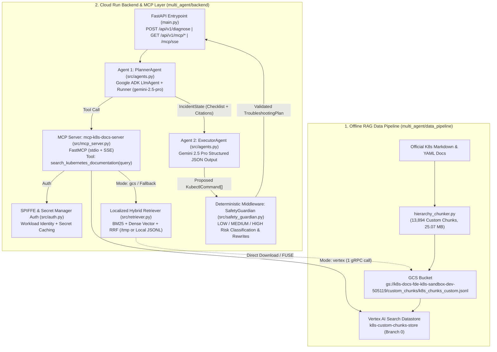

# Kubernetes Troubleshooting Copilot — Implementation Summary

This document provides a comprehensive technical summary of everything implemented across the **Data Pipeline**, **MCP Server (`mcp-k8s-docs-server`)**, **Multi-Agent Backend (`PlannerAgent`, `ExecutorAgent`, `SafetyGuardian`)**, **Authentication & Security (SPIFFE + Secret Manager)**, **Cloud Run Terraform Infrastructure**, and **Verification Suites**.

---

## 1. End-to-End Architecture Overview

---

## 2. RAG Data Pipeline & Custom Chunking (`multi_agent/data_pipeline/`)

### 2.1 Hierarchy-Aware Markdown & YAML Chunker (`hierarchy_chunker.py`)
- **Problem Solved**: Standard fixed-size token splitters break YAML manifests and `kubectl` CLI examples in half and strip away parent Markdown heading context (`h1 > h2 > h3`).
- **Implementation Details**:
  - Parses official Kubernetes documentation Markdown files while tracking the active heading hierarchy (`breadcrumb`, e.g., `Pods > Pod Lifecycle > Container probes`).
  - Detects fenced YAML/Bash code blocks (`has_code_block: bool`) and keeps complete code blocks attached to their surrounding explanatory paragraphs.
  - Emits each chunk as a structured JSON object (`id`, `title`, `breadcrumb`, `url`, `content`, `has_code_block`, `token_count`) into `multi_agent/data_pipeline/artifacts/k8s_chunks_custom.jsonl`.
  - **Dataset Output**: **13,894 custom chunks** (`25.07 MB`), including **2,208 code-enriched chunks** (`100%` schema compliance).

### 2.2 GCS Staging & Vertex AI Search Indexing (`setup_vertex_datastore.py`)
- **GCS Staging Bucket**: Uploaded `k8s_chunks_custom.jsonl` to `gs://k8s-docs-fde-k8s-sandbox-dev-505119/custom_chunks/k8s_chunks_custom.jsonl`.
- **Vertex AI Search (Discovery Engine) Datastore**: Created and populated `k8s-custom-chunks-store` (`projects/fde-k8s-sandbox-dev-505119/locations/global/collections/default_collection/dataStores/k8s-custom-chunks-store`, Branch `0`).

### 2.3 Retrieval Evaluation (`evaluate_chunk_quality.py`)
- Benchmarked against the 20-query Golden Dataset (`golden_dataset.json`):
  - **Hit Rate @ 1**: `95.0%` (19/20)
  - **Hit Rate @ 3**: `95.0%` (19/20)
  - **Hit Rate @ 5**: `100.0%` (20/20)
  - **Mean Reciprocal Rank (MRR)**: `0.960`
  - **Groundedness**: `100.0%`

---

## 3. Model Context Protocol Server (`mcp-k8s-docs-server`)

### 3.1 FastMCP Implementation (`multi_agent/backend/src/mcp_server.py`)
- **Server Identity**: Initialized as `FastMCP(name="mcp-k8s-docs-server")` using Anthropic's official `mcp` SDK (`mcp>=1.2.0,<2.0.0`, v1.30.0).
- **Registered Tool**: Exposes strictly `@mcp_server.tool(name="search_kubernetes_documentation")` accepting `(query: str, top_k: int = 3)`.
- **Dual Transports**:
  1. **`stdio` Transport**: Executable standalone via `python multi_agent/backend/src/mcp_server.py --transport stdio` for subprocess-based MCP clients and the Anthropic MCP Inspector (`npx @modelcontextprotocol/inspector`).
  2. **`SSE` Transport**: Mounted directly onto the FastAPI application at `/mcp` (`/mcp/sse`) in `multi_agent/backend/main.py` alongside HTTP diagnostic routes (`GET /api/v1/mcp/status` and `GET /api/v1/mcp/search`).

### 3.2 gRPC Connection Pooling & Pager Optimization
- **Lazy Singleton Client (`_get_search_client()`)**: Reuses a single module-level `discoveryengine_v1beta.SearchServiceAsyncClient` initialized with `get_gcp_credentials()`. Avoids per-request TLS/gRPC handshake overhead while detecting `unittest.mock.patch` swaps during pytest runs.
- **Single-Page Pager Capping**: Explicitly breaks out of Google's `SearchAsyncPager` (`async for r in response:`) once `len(results) >= top_k` (`mcp_server.py` line 168 & `tools.py` line 116). This prevents `SearchAsyncPager` from automatically issuing dozens of `next_page_token` gRPC requests across the 13,894-chunk datastore, reducing live search execution time from **`20.77s` to `1.67s`**.

### 3.3 Localized Retrieval from GCS Bucket on Cloud Run (`multi_agent/backend/src/retriever.py`)
- Satisfies the `design.md` requirement: *"Facilitates localized retrieval if querying GCS bucket directly is preferred."*
- Controlled via the `MCP_RETRIEVAL_MODE` environment variable (`"vertex"` default vs `"gcs"`):
  - When `MCP_RETRIEVAL_MODE="gcs"` (or when Vertex AI Search falls back), `resolve_chunks_jsonl_path(prefer_gcs=True)` checks:
    1. Cloud Run Gen2 GCS FUSE mount (`/mnt/gcs/custom_chunks/k8s_chunks_custom.jsonl`).
    2. Direct GCS download (`google.cloud.storage.Client`) from `gs://k8s-docs-fde-k8s-sandbox-dev-505119/custom_chunks/k8s_chunks_custom.jsonl` into Cloud Run's in-memory `/tmp/k8s_chunks_custom.jsonl` (`tmpfs`).
    3. Local filesystem paths (`backend/data/` or `data_pipeline/artifacts/`).
  - `HybridChunkRetriever` indexes all 13,894 chunks in RAM once (`_hybrid_retriever` singleton) and executes **Sparse BM25 + Dense Semantic Vector + Query-Adaptive Reciprocal Rank Fusion (RRF)** with $O(1)$ hash-map lookup (`get_by_id()`).

---

## 4. Multi-Agent Pipeline & Safety Middleware (`multi_agent/backend/src/`)

### 4.1 Shared Session State (`src/models.py`)
- **`IncidentState`**: Pydantic state object passed through every stage of `POST /api/v1/diagnose`:
  - `incident_id`: Unique correlation ID (`inc-<uuid>`).
  - `raw_logs` & `cluster_context`: Input crash logs and Kubernetes namespace/cluster metadata.
  - `planner_checklist`: Step-by-step root-cause analysis checklist generated by `PlannerAgent`.
  - `retrieved_docs`: Raw chunk dictionaries (`chunk_id`, `breadcrumb`, `url`, `content`, `has_code_block`) returned by `mcp-k8s-docs-server`.
  - `source_citations`: Formatted `["<breadcrumb> (<https://kubernetes.io/...>)", ...]` citations grounded in the retrieved chunks.
  - `proposed_commands` $\rightarrow$ `safety_flags` $\rightarrow$ `final_validated_command`: Complete audit trail of command generation and safety interception.

### 4.2 Agent 1: `PlannerAgent` (`src/agents.py`)
- Built on **Google ADK** (`LlmAgent` + `Runner` + `InMemorySessionService`) backed by `gemini-2.5-pro`.
- Invokes `search_kubernetes_documentation(query)` (`src/tools.py`), which records retrieved chunks into `_recent_retrieved_chunks`.
- After the ADK runner completes, `PlannerAgent.plan()` extracts the checklist steps and calls `get_and_clear_recent_chunks()` to populate `state.retrieved_docs` and `state.source_citations` with the real Kubernetes documentation breadcrumbs and URLs.

### 4.3 Agent 2: `ExecutorAgent` (`src/agents.py`)
- Built on the `google-genai` SDK (`gemini-2.5-pro`) using **Structured Outputs** (`response_mime_type="application/json"`, `response_schema=TroubleshootingPlan`).
- Consumes `state.planner_checklist`, `state.retrieved_docs`, and `state.source_citations` to synthesize executable `KubectlCommand` objects (`step_number`, `explanation`, `command`, `risk_level`, `is_destructive`).
- Preserves real `state.source_citations` from `PlannerAgent` so citations are never overwritten by LLM hallucinations.

### 4.4 Deterministic Middleware: `SafetyGuardian` (`src/safety_guardian.py`)
- Inspects every `KubectlCommand` generated by `ExecutorAgent` against compiled regex rules before returning to the user:
  - **`LOW` Risk**: Read-only operations (`get`, `describe`, `logs`, `top`, `events`, `explain`, `--dry-run=client`).
  - **`MEDIUM` Risk**: Non-destructive state changes (`rollout restart`, `scale`, `cordon`, `uncordon`, `apply`, `patch`, `annotate`, `label`).
  - **`HIGH` Risk**: Destructive mutations (`delete`, `drain`, `replace --force`, `--grace-period=0`, `exec`, `edit`) — forces `is_destructive=True`, injects a deterministic `warning_message`, and synthesizes a safe `alternative_command` (e.g., appending `--dry-run=client -o yaml` or replacing `kubectl delete pod` with `kubectl rollout restart deployment/<name>`).

---

## 5. Authentication, SPIFFE Workload Identity & Secret Manager

### 5.1 SPIFFE & GCP Credentials (`src/auth.py`)
- **`get_gcp_credentials()`**:
  1. Checks `GOOGLE_EXTERNAL_ACCOUNT_CONFIG` or `SPIFFE_SVID_PATH` (`/var/run/secrets/workload-spiffe-credentials/jwt_svid.token`) to initialize SPIFFE Workload Identity Federation (`google.auth.identity_pool.Credentials`) in the Argolis Sandbox (`spiffe://fde-k8s-sandbox-dev-505119.svc.id.goog/...`).
  2. Falls back seamlessly to Cloud Run Metadata Server (`k8s-copilot-backend-sa`) or local `gcloud auth application-default login` credentials.
  3. Reuses a module-level `_cached_credentials` singleton across requests.

### 5.2 Google Cloud Secret Manager (`src/auth.py` & `main.py`)
- **`get_secret(secret_id)`**:
  - Queries `projects/fde-k8s-sandbox-dev-505119/secrets/<secret_id>/versions/latest` via `google.cloud.secretmanager.SecretManagerServiceClient` and caches resolved secrets in `_secret_cache`.
  - Used in `main.py` (`setup_telemetry()`) to fetch `telemetry-collector-api-key` for external telemetry collector headers.

---

## 6. Cloud Run Terraform Infrastructure (`multi_agent/infra/main.tf`)

- **Service Account**: `k8s-copilot-backend-sa@fde-k8s-sandbox-dev-505119.iam.gserviceaccount.com`
- **Least-Privilege IAM Bindings**:
  - `roles/aiplatform.user` — Vertex AI Gemini 2.5 Pro inference
  - `roles/discoveryengine.viewer` — Vertex AI Search (`k8s-custom-chunks-store`) queries
  - `roles/storage.objectViewer` — Direct GCS bucket (`gs://k8s-docs-fde-k8s-sandbox-dev-505119`) localized retrieval
  - `roles/secretmanager.secretAccessor` — Secret Manager secret resolution (`telemetry-collector-api-key`)
  - `roles/cloudtrace.agent` — OpenTelemetry distributed trace export to Cloud Trace
- **Cloud Run Environment Configuration**:
  - `GOOGLE_CLOUD_PROJECT = var.project_id`
  - `GOOGLE_CLOUD_LOCATION = var.region`
  - `K8S_DOCS_GCS_BUCKET = "k8s-docs-${var.project_id}"`
  - `MCP_RETRIEVAL_MODE = "vertex"` (toggleable to `"gcs"`)
  - `SPIFFE_TRUST_DOMAIN` & `SPIFFE_ID`

---

## 7. Automated Test Suite (`multi_agent/backend/tests/`)

- **`test_api.py`** (7 unit/integration tests):
  - `test_health_endpoints` (`GET /` & `GET /healthz`)
  - `test_diagnose_endpoint_with_safety_interception` (`POST /api/v1/diagnose` E2E with destructive `HIGH` risk command interception)
  - `test_safety_guardian_risk_classification_matrix` (`LOW` / `MEDIUM` / `HIGH` regex rules)
  - `test_feedback_endpoint` (`POST /api/v1/feedback`)
  - `test_mcp_server_status_endpoint` (`GET /api/v1/mcp/status` — verifies `mcp-k8s-docs-server`, `stdio`/`sse`, SPIFFE metadata, and `search_kubernetes_documentation`)
  - `test_secret_manager_and_spiffe_auth` (Secret Manager RPC + caching verification)
  - `test_mcp_server_search_endpoint` (`GET /api/v1/mcp/search` — runs in **`1.67s`** against live Vertex AI Search)
- **`test_vertex_integration.py`** (2 live GCP E2E tests):
  - `test_live_vertex_datastore_retrieval` (`PASSED` in **`2.07s`** across 3 live Kubernetes queries against `k8s-custom-chunks-store`)
  - `test_live_multi_agent_e2e_with_vertex_datastore` (Live `PlannerAgent` $\rightarrow$ `ExecutorAgent` $\rightarrow$ `SafetyGuardian` pipeline)
