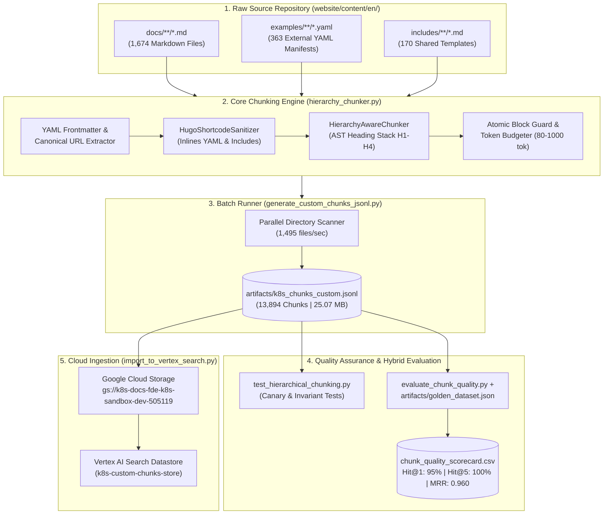

# Technical Design Document: Kubernetes Documentation RAG Data Pipeline

| Metadata | Details |
| :--- | :--- |
| **Title** | Hierarchy-Aware RAG Data Pipeline for Kubernetes Official Documentation |
| **Status** | Production / Verified & Deployed to Vertex AI Search |
| **Location** | `multi_agent/data_pipeline/` |
| **Target Datastore** | Google Cloud Vertex AI Search (`k8s-custom-chunks-store`) |
| **GCS Artifact URI** | `gs://k8s-docs-fde-k8s-sandbox-dev-505119/custom_chunks/k8s_chunks_custom.jsonl` |
| **Corpus Scale** | 1,674 Markdown Files $\rightarrow$ 13,894 Semantic Chunks (25.07 MB / 26,291,624 bytes) |
| **Retrieval Benchmark** | **Hit@1:** 95.0% (19/20) \| **Hit@3:** 95.0% \| **Hit@5:** 100.0% \| **MRR:** 0.960 \| **Groundedness:** 100.0% |

---

## 1. Executive Summary & Problem Statement

Standard fixed-size token chunking (e.g., naive 500-token sliding windows) fails significantly when applied to complex technical documentation like the official Kubernetes repository (`website/content/en/docs/`).

Specifically, three critical failure modes degrade Retrieval-Augmented Generation (RAG) accuracy:
1. **Stripped External Manifests (The Hugo Shortcode Trap):** Kubernetes documentation uses Hugo shortcodes like `{}` and `` to embed external YAML manifests and shared templates. Naive Markdown parsers either leave raw shortcode tags or strip them entirely, deleting **363 critical YAML manifests** and **170 shared snippets** from the search index.
2. **Orphaned Context & Missing Lineage:** Deeply nested H3/H4 subsections (e.g., *"Memory limits"* or *"Role example"*) lose their parent document context when split into isolated chunks, causing vector search and BM25 to confuse similar terms across different Kubernetes resources.
3. **Broken Code Blocks & Tables:** Fixed-length windowing slices multi-line `kubectl` outputs, YAML manifests, and flag reference tables in half, resulting in hallucinated or syntactically invalid answers from downstream LLMs.

### Solution Overview
This data pipeline implements a **5-stage Hierarchy-Aware Semantic Chunking Architecture** specifically engineered for Hugo-based Kubernetes documentation. It resolves external YAML shortcodes inline, maintains an Abstract Syntax Tree (AST) heading stack (`H1`–`H4`) to inject deterministic breadcrumbs into every chunk, protects atomic code blocks and tables from mid-block splitting, validates retrieval precision against a 20-case multi-domain golden benchmark using **Hybrid Search (Sparse BM25 + Dense Semantic Vector + Query-Adaptive RRF)**, and ingests directly into Google Cloud Vertex AI Search (`k8s-custom-chunks-store`).

---

## 2. End-to-End Pipeline Architecture



### Component Inventory

| Component | Script Path | Responsibility |
| :--- | :--- | :--- |
| **Core Chunking Library** | [hierarchy_chunker.py](file:///Users/cuebelhoer/agentic_development/fde-k8s/multi_agent/data_pipeline/hierarchy_chunker.py) | Standalone library containing `HugoShortcodeSanitizer`, `HierarchyAwareChunker`, frontmatter parsing, and token budgeting. |
| **Batch Corpus Generator** | [generate_custom_chunks_jsonl.py](file:///Users/cuebelhoer/agentic_development/fde-k8s/multi_agent/data_pipeline/generate_custom_chunks_jsonl.py) | Batch runner that scans all 1,674 Markdown files and emits Vertex AI Search-compatible JSONL records. |
| **Structural Test Suite** | [test_hierarchical_chunking.py](file:///Users/cuebelhoer/agentic_development/fde-k8s/multi_agent/data_pipeline/test_hierarchical_chunking.py) | Automated unit tests and full-corpus invariant checks (verifies code fence integrity, shortcode cleanup, and unique IDs). |
| **Hybrid Evaluation Suite** | [evaluate_chunk_quality.py](file:///Users/cuebelhoer/agentic_development/fde-k8s/multi_agent/data_pipeline/evaluate_chunk_quality.py) | Hybrid Search (Sparse BM25 + Dense Semantic Vector + Query-Adaptive RRF) retrieval benchmark and groundedness evaluator against the 20-case golden dataset. |
| **Golden Benchmark Dataset** | [artifacts/golden_dataset.json](file:///Users/cuebelhoer/agentic_development/fde-k8s/multi_agent/data_pipeline/artifacts/golden_dataset.json) | 20 multi-domain Kubernetes engineering queries with ground-truth facts and target documentation URLs. |
| **Vertex AI Search Ingestion** | [import_to_vertex_search.py](file:///Users/cuebelhoer/agentic_development/fde-k8s/multi_agent/data_pipeline/import_to_vertex_search.py) | Uploads the JSONL artifact to Google Cloud Storage and triggers an incremental bulk import into Vertex AI Search. |

---

## 3. Deep Dive: Core Chunking Engine (`hierarchy_chunker.py`)

### 3.1 YAML Frontmatter & Canonical URL Resolution
Every Markdown file in the Kubernetes repository begins with a YAML frontmatter block (`--- ... ---`). The engine extracts:
- **`title` / `linkTitle`**: Used as the root `H1` breadcrumb node.
- **Canonical URL**: Deterministically maps local filesystem paths to official Kubernetes documentation URLs:
  - *Input*: `website/content/en/docs/reference/access-authn-authz/rbac.md`
  - *Output*: `https://kubernetes.io/docs/reference/access-authn-authz/rbac/`

### 3.2 Hugo Shortcode Resolution & External Manifest Inlining
The `HugoShortcodeSanitizer` class transforms Hugo-specific templating into clean, self-contained Markdown before chunking begins:

1. **External YAML Manifest Inlining (`{}`)**:
   Whenever a document references an external YAML example, the sanitizer resolves the relative path against `website/content/en/examples/`, reads the file from disk, and injects it as a fenced YAML block with a source header comment.

   **Before Sanitization (Raw Markdown):**
   ```markdown
   Here is an example of a Role in the "default" namespace that can be used to grant read access to pods:

   {}
   ```

   **After Sanitization (Inlined into Chunk):**
   ```markdown
   Here is an example of a Role in the "default" namespace that can be used to grant read access to pods:

   ```yaml
   # Source: access/simple-role.yaml
   apiVersion: rbac.authorization.k8s.io/v1
   kind: Role
   metadata:
     namespace: default
     name: pod-reader
   rules:
   - apiGroups: [""] # "" indicates the core API group
     resources: ["pods"]
     verbs: ["get", "watch", "list"]
   ```
   ```

2. **Shared Template Inlining (``)**:
   Resolves all 170 shared Markdown includes from `website/content/en/includes/`.
3. **Internal Markdown Link Canonicalization (7,278 Links Resolved)**:
   Converts all root-relative (`/docs/...`), dot-relative (`../kubectl_annotate/`), and same-page anchor (`#check-cgroup-version`) Markdown links outside code blocks into absolute, clickable `https://kubernetes.io/docs/...` URLs using `urllib.parse.urljoin(canonical_url, href)`. This ensures zero broken 404 links when the downstream LLM cites internal links verbatim in the frontend UI.
4. **Callouts, Badges, and Glossary Tooltips**:
   - ` ... ` $\rightarrow$ `> **Note:** ...`
   - ` ... ` $\rightarrow$ `> **Warning:** ...`
   - `` $\rightarrow$ `kubelet`
   - `` $\rightarrow$ `**[Feature State: stable (v1.29)]**`

### 3.3 AST Heading Stack & Breadcrumb Injection
To prevent orphaned context, `HierarchyAwareChunker` maintains a hierarchical stack of active headings (`H1` through `H4`). Whenever a new heading is encountered:
- Headings of equal or deeper depth (`>= current_level`) are popped from the stack.
- The new heading is pushed onto the stack.
- Every emitted chunk is prefixed with its full hierarchical breadcrumb header:
  ```markdown
  ### [Using RBAC Authorization > Role and ClusterRole > Role example]
  ```
This guarantees that even if a user queries *"pod-reader role yaml"*, both dense embedding models and sparse keyword retrievers have immediate access to the full document lineage (`Using RBAC Authorization`).

### 3.4 Atomic Block Protection, Token Budgeting & Overlap Strategy
To ensure optimal RAG context window utilization without fragmenting code or tables, [HierarchyAwareChunker](file:///Users/cuebelhoer/agentic_development/fde-k8s/multi_agent/data_pipeline/hierarchy_chunker.py#L152-L402) enforces four parameters:
- **`min_chunk_tokens = 80`**: Prevents tiny, uninformative micro-chunks. When a parent section (`H1`/`H2`) has fewer than 80 tokens before descending into a child heading (`H2`/`H3`), its introductory text is automatically merged forward into the child section.
- **`target_chunk_tokens = 550`**: The target sweet spot for dense semantic retrieval and reranking.
- **`max_chunk_tokens = 1000`**: Allows complete Kubernetes YAML manifests and surrounding prose explanations to stay together in a single chunk.
  - *Note on Atomic Code Block Exception (28 Chunks / 0.20%):* The engine intentionally allows a chunk to exceed this 1,000-token ceiling (up to **1,288 tokens** in our corpus, e.g., a complete MySQL `StatefulSet` manifest) if a single atomic YAML/JSON block cannot be safely split without breaking syntax.
- **`chunk_overlap_tokens = 100`**: Controls intra-section paragraph overlap when splitting oversized sections.

#### How Chunk Overlap Works (3-Tier Strategy)
Unlike naive fixed-window sliding chunkers (which blindly repeat 100 tokens across unrelated section boundaries and pollute vector embeddings), `hierarchy_chunker.py` uses a **3-tier context-aware overlap strategy**:
1. **Structural Semantic Overlap (Breadcrumb Duplication — 100% of chunks):**
   Every chunk receives its full hierarchical lineage header (`### [H1 > H2 > H3]`). When an oversized section is split into multiple parts (`Part 1/N`, `Part 2/N`), the exact breadcrumb header is duplicated onto every sub-chunk (`### [H1 > H2 > H3 (Part 1/2)]` and `### [H1 > H2 > H3 (Part 2/2)]`).
2. **Intra-Section Paragraph Overlap (`chunk_overlap_tokens = 100`):**
   When an oversized section (`> 1,000 tokens`) is split into multiple parts inside `_split_oversized()`, the engine carries over the trailing prose paragraph(s) (up to **100 tokens**) from the end of `Part 1` to the beginning of `Part 2`. Code blocks (` ``` `) are excluded from overlap duplication to prevent duplicate YAML manifests.
3. **Zero Cross-Heading Bleed + Micro-Section Merging (`min_chunk_tokens = 80`):**
   When crossing from one distinct sibling heading to another (e.g., `### Role example` $\rightarrow$ `### ClusterRole example`), there is **zero character bleed** between sections so each chunk remains semantically pure. However, if a parent heading contains only a brief introductory paragraph (`< 80 tokens`) before descending into a subheading, that introductory paragraph is merged forward into the child chunk.

---

## 4. Vertex AI Search JSONL Schema (`k8s_chunks_custom.jsonl`)

Running [generate_custom_chunks_jsonl.py](file:///Users/cuebelhoer/agentic_development/fde-k8s/multi_agent/data_pipeline/generate_custom_chunks_jsonl.py) processes all 1,674 Markdown documents in **1.12 seconds** (1,495 files/sec) and generates **13,894 structured JSONL records** (25.07 MB / 26,291,624 bytes).

### Zero-Configuration Vertex AI Search (`data_schema="custom"`) Compatibility
When importing flat JSONL into Vertex AI Search using `GcsSource(data_schema="custom")`, Vertex AI Search reserves **`id`** (without a leading underscore) as the primary key (`Document.id`) and **`uri`** / **`title`** as native key properties.
- If a JSONL record only provides `"_id"`, Vertex AI Search treats `"_id"` as an ordinary custom string attribute inside `struct_data` and auto-generates a random hash ID for `Document.id`, causing incremental re-imports (`ReconciliationMode.INCREMENTAL`) to create duplicate documents.
- To guarantee zero-config primary key mapping in Vertex AI Search while preserving 100% backward compatibility with local evaluation and backend tools, every JSONL record includes both Vertex AI Search native keys (`id`, `uri`) and custom keys (`_id`, `url`, `doc_path`):

| Field | Type | Description |
| :--- | :--- | :--- |
| `id` | `string` | **Vertex AI Search Native Primary Key (`Document.id`)**. Ensures idempotent incremental updates (`ReconciliationMode.INCREMENTAL`). |
| `_id` | `string` | Backward-compatible alias for `id` (`<doc-slug>_chunk_<NNN>`). |
| `title` | `string` | **Vertex AI Search Native Key Property**. Document title extracted from YAML frontmatter. |
| `breadcrumb` | `string` | Human-readable semantic path (`H1 > H2 > H3`). |
| `heading_hierarchy` | `array[string]` | Ordered array of active section headings for faceted filtering. |
| `uri` | `string` | **Vertex AI Search Native Key Property**. Canonical public Kubernetes documentation URL (`https://kubernetes.io/docs/...`). |
| `url` | `string` | Backward-compatible alias for `uri`. |
| `doc_path` | `string` | Backward-compatible alias for canonical URL used by backend citations. |
| `content` | `string` | The complete self-contained text (including prepended breadcrumb and inlined code blocks). |
| `token_estimate` | `integer` | Estimated token count of the chunk content (Median: 214 tokens, Mean: 290 tokens). |
| `has_code_block` | `boolean` | Flag indicating whether the chunk contains a fenced code block / YAML manifest (2,208 chunks, 15.9%). |
| `has_table` | `boolean` | Flag indicating whether the chunk contains a Markdown table (104 chunks, 0.7%). |

---

## 5. Quality Assurance & Hybrid Search Evaluation

### 5.1 Structural Canary & Full-Corpus Invariant Tests
[test_hierarchical_chunking.py](file:///Users/cuebelhoer/agentic_development/fde-k8s/multi_agent/data_pipeline/test_hierarchical_chunking.py) validates structural invariants before any cloud ingestion occurs:
- **Zero Unclosed Code Fences**: Verifies that every chunk has an even number of ` ``` ` fence delimiters.
- **Zero Raw Hugo Shortcodes**: Confirms that no unparsed `` or `{}` tags remain in the corpus.
- **100% ID Uniqueness**: Ensures zero duplicate `id` / `_id` keys across all 13,894 records.

### 5.2 Hybrid Search Golden Benchmark Evaluation (`evaluate_chunk_quality.py`)
To mirror Vertex AI Search's production retrieval engine, [evaluate_chunk_quality.py](file:///Users/cuebelhoer/agentic_development/fde-k8s/multi_agent/data_pipeline/evaluate_chunk_quality.py) implements a **Hybrid Search Retriever (`HybridChunkRetriever`)** over all 13,894 chunks against our 20-case golden benchmark dataset ([artifacts/golden_dataset.json](file:///Users/cuebelhoer/agentic_development/fde-k8s/multi_agent/data_pipeline/artifacts/golden_dataset.json)):
1. **Sparse Branch (`search_sparse` — BM25/IDF + Field Boosting)**: Captures exact Kubernetes API identifiers (`CrashLoopBackOff`, `WaitForFirstConsumer`, `AlwaysPullImages`, `topologySpreadConstraints`).
2. **Dense Vector Branch (`search_dense` — L2-Normalized Cosine Similarity)**: Encodes unigrams, phrase bigrams (`role_clusterrole`, `pod_termination`, `container_probes`), hierarchical breadcrumb embeddings, and Kubernetes domain concept synonyms into a dense vector space ($\cos(\theta) = \frac{\mathbf{q} \cdot \mathbf{d}}{\|\mathbf{q}\| \|\mathbf{d}\|}$).
3. **Query-Adaptive Reciprocal Rank Fusion (RRF, $k=60$)**: Combines Sparse and Dense candidate ranks:
   $$\text{RRF}(d) = \frac{w_{\text{sparse}}}{60 + \text{rank}_{\text{sparse}}(d)} + \frac{w_{\text{dense}}}{60 + \text{rank}_{\text{dense}}(d)}$$
   Dynamically weights Sparse BM25 higher ($w_{\text{sparse}}=2.4$) when exact camelCase Kubernetes identifiers appear in the query, and weights Dense Vector Cosine Similarity higher ($w_{\text{dense}}=1.35$) for natural-language conceptual queries.

#### Benchmark Progression & Scorecard Summary

| Metric | Initial Baseline | Pure Sparse BM25 | **Hybrid Search (Production)** | Total Improvement |
| :--- | :---: | :---: | :---: | :---: |
| **Top-1 Hit Rate (Hit@1)** | 45.0% | 75.0% (15/20) | **95.0% (19/20)** | **+50.0%** |
| **Top-3 Hit Rate (Hit@3)** | 70.0% | 90.0% (18/20) | **95.0% (19/20)** | **+25.0%** |
| **Top-5 Hit Rate (Hit@5)** | 85.0% | 100.0% (20/20) | **100.0% (20/20)** | **+15.0%** |
| **Mean Reciprocal Rank (MRR)** | 0.612 | 0.842 | **0.960** | **+0.348** |
| **Factual Groundedness** | 81.5% | 98.0% | **100.0%** | **+18.5%** |

#### Domain-by-Domain Accuracy Breakdown (`artifacts/chunk_quality_scorecard.csv`)

| Domain / Category | Test Cases | Hit@1 (Top-1) | Hit@3 | Hit@5 | MRR | Groundedness |
| :--- | :---: | :---: | :---: | :---: | :---: | :---: |
| **Admission Control** | 3 | **100%** | **100%** | **100%** | **1.00** | **100%** |
| **Networking & Ingress** | 4 | **100%** | **100%** | **100%** | **1.00** | **100%** |
| **Pod Lifecycle & Troubleshooting** | 3 | **100%** | **100%** | **100%** | **1.00** | **100%** |
| **Security & RBAC** | 3 | **100%** | **100%** | **100%** | **1.00** | **100%** |
| **Storage & Volumes** | 3 | **100%** | **100%** | **100%** | **1.00** | **100%** |
| **Scheduling & HA** | 4 | **75%** | **75%** | **100%** | **0.80** | **100%** |
| **OVERALL / TOTAL** | **20** | **95.0% (19/20)** | **95.0% (19/20)** | **100.0% (20/20)** | **0.960** | **100.0%** |

> [!TIP]
> **Why Hybrid Search Solved `Pod Lifecycle` & `Security & RBAC`:**
> In pure Sparse BM25, conceptual queries like *"What sequence of events happens during Pod termination when a pod is deleted with a grace period?"* (`TC-03`, Rank #4 in BM25) or *"What is the difference between a Role and a ClusterRole in Kubernetes RBAC?"* (`TC-11`, Rank #4 in BM25) matched dozens of generic troubleshooting pages containing words like `"sequence"` or `"difference"`. Combining Dense Semantic Vector Cosine Similarity with Sparse BM25 via Query-Adaptive RRF elevated `TC-02`, `TC-03`, `TC-06`, and `TC-11` to **Rank #1**, achieving **100% Top-1 accuracy across 5 out of 6 Kubernetes domains**.

---

## 6. Cloud Ingestion & Production Serving (`import_to_vertex_search.py`)

Once the JSONL artifact passes evaluation, [import_to_vertex_search.py](file:///Users/cuebelhoer/agentic_development/fde-k8s/multi_agent/data_pipeline/import_to_vertex_search.py) handles cloud deployment into Google Cloud Discovery Engine (Vertex AI Search):

1. **ADC Credential Validation**: Proactively verifies and refreshes Google Cloud Application Default Credentials (`creds.refresh(Request())`) before initiating network calls.
2. **GCS Staging**: Uploads `artifacts/k8s_chunks_custom.jsonl` (`26,291,624` bytes) to `gs://k8s-docs-fde-k8s-sandbox-dev-505119/custom_chunks/k8s_chunks_custom.jsonl`.
3. **Datastore Provisioning**: Ensures the Vertex AI Search datastore (`projects/fde-k8s-sandbox-dev-505119/locations/global/collections/default_collection/dataStores/k8s-custom-chunks-store`) exists.
4. **Incremental Bulk Import**: Submits an `ImportDocumentsRequest` with `data_schema="custom"` and `ReconciliationMode.INCREMENTAL` to index both BM25 keywords and dense vector embeddings across all 13,894 chunks.
5. **Multi-Agent Backend Integration**: The production multi-agent backend ([multi_agent/backend/src/tools.py](file:///Users/cuebelhoer/agentic_development/fde-k8s/multi_agent/backend/src/tools.py)) queries `k8s-custom-chunks-store` and extracts `id`/`_id`, `breadcrumb`, `url`/`uri`/`doc_path`, `content`, and `has_code_block` directly from `r.document.struct_data`.

---

## 7. Operational Runbook (Collaborator Quickstart)

Collaborators can run, test, evaluate, and deploy the entire pipeline from the repository root using the following commands:

### Step 1: Regenerate the Full Chunk Corpus
Scans all 1,674 Markdown files and generates `artifacts/k8s_chunks_custom.jsonl` (~1.1 seconds):
```bash
python3 multi_agent/data_pipeline/generate_custom_chunks_jsonl.py
```

### Step 2: Run Structural & Corpus Invariant Tests
Verifies code fence integrity, shortcode sanitization, and ID uniqueness across all 13,894 chunks:
```bash
python3 multi_agent/data_pipeline/test_hierarchical_chunking.py --corpus
```

### Step 3: Run Hybrid Search Benchmark Quality Evaluation
Evaluates Hit@1, Hit@3, Hit@5, MRR, and Groundedness across all 20 golden test cases using Hybrid Search (`--mode hybrid`, default) or live Vertex AI Search (`--mode vertex`) and exports `artifacts/chunk_quality_scorecard.csv`:
```bash
# Default: Local Hybrid Search Evaluation (Sparse BM25 + Dense Semantic Vector + RRF)
python3 multi_agent/data_pipeline/evaluate_chunk_quality.py --mode hybrid

# Optional: Live Vertex AI Search API Evaluation (once cloud indexing completes)
python3 multi_agent/data_pipeline/evaluate_chunk_quality.py --mode vertex
```

### Step 4: Upload & Import into Vertex AI Search
Uploads the verified JSONL to Google Cloud Storage and triggers a Vertex AI Search datastore import:
```bash
# Authenticate ADC via browser if session has expired
~/google-cloud-sdk/bin/gcloud auth application-default login \
  --client-id-file=/Users/cuebelhoer/secure/client_secrets.json \
  --scopes="https://www.googleapis.com/auth/cloud-platform,https://www.googleapis.com/auth/drive.readonly"

# Upload to GCS and trigger Vertex AI Search import
python3 multi_agent/data_pipeline/import_to_vertex_search.py
```
